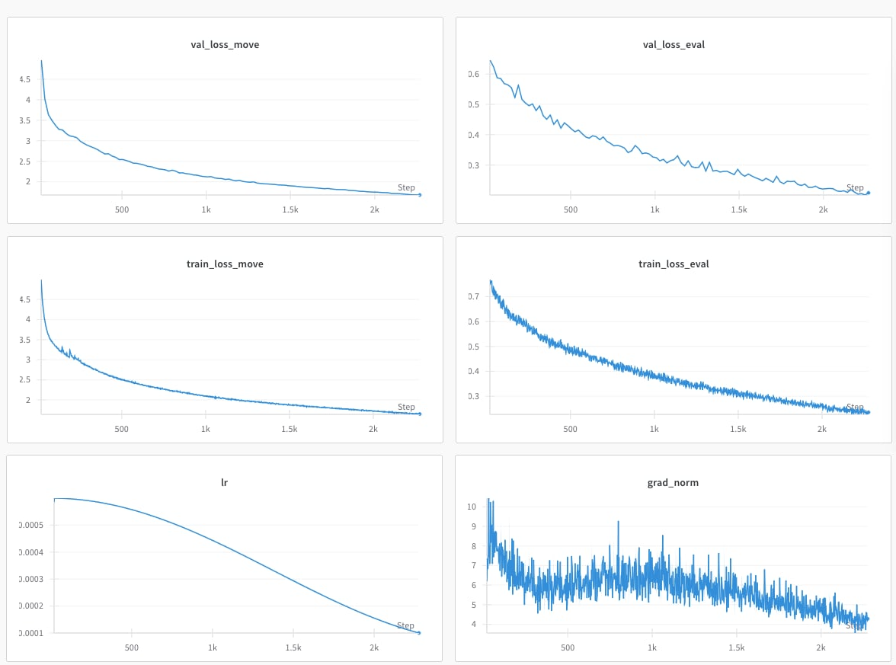

# ChessTransformer

A transformer similar to GPT2-124M trained to predict Stockfish evaluation and best move, on 132M chess positions. 

Bot available to play against here: https://lichess.org/@/alphaminustwo. No tree search, just sampling in the predicted move distribution, among legal moves.

## Dataset

Dataset consists in approx. 350M chess positions (https://www.kaggle.com/datasets/lichess/chess-evaluations) along with stockfish evaluation. The dataset is stored as a CSV as follow:

- `fen`: the position FEN contains pieces, active color, castling rights, and en passant square
- `line`: the principal variation, in UCI format
- `depth`: the depth reached by the engine
- `knodes`: the number of kilo-nodes searched by the engine
- `cp`: the position's centipawn evaluation. This is None if mate is certain
- `mate`: the position's mate evaluation. This is None if mate is not certain

We deduplicate this dataset to 132M unique chess positions, and train the network to predict both evaluation and best move. 

Dataset can be downloaded with `scripts/download.py`.

## Data Processing

### Input

The FEN is transformed into a 64x18 tensor, where each element of the sequence is a {0,1} tensor representation of a square, as a concatenation of:

```
- a 12 one-hot tensor encoding the piece (6 white and 6 black pieces)
- a 1-tensor, equal to 1 if white is to move, 0 otherwise.
- a 1-tensor, equal to 1 if white can castle, 0 otherwise.
- a 1-tensor, equal to 1 if black can castle, 0 otherwise.
- a 1-tensor, equal to 1 if this square is subject to en-passant, 0 otherwise.
```

### Output

#### Evaluation:

Two cases:
- Mate is forced, evaluation ranges from `4 / 3` (mate in 15 moves) to `4.` (mate in 1).
- Mate is not forced, evaluation: `min(centipawn / 1500, 4.)`

Thus, evaluation ranges from `-4.` to `4.`. Mean value is `~0.2` and variance is `~1.25`.

#### Best move:

Best move is encoded as a 64x64 one-hot representation of the starting and ending squares.


Implementation can be found in `alphaminustwo/dataset.py`.

## Model

The model is a transformer very similar to GPT2-124M, where the token embedding is replaced by a Linear layer of shape `18x768`. The language model head is replaced by two heads, MLPs, to predict the evaluation and best move.

Implementation can be found in `alphaminustwo/model.py`.

## Baselines:

We Stockfish at depth 1 as a baseline, which 

## Training:

We train the model for 1 epoch on a RTX-4090, which takes approx. 24h.

We use Mean Square Error for evaluation prediction and Negative Log-Likelihood for best move prediction. We set the loss to `evaluation_loss + 0.5 * move_loss`, so that loss scale in similar to the one from GPT-2 (ln(50257) ~= 10). We use a batch size of `512`, linear warmup for 2000 steps and cosine annealing until the end of the training.

On validation set, we obtain a loss of `0.21` on evaluation and `1.56` on move prediction.

The curves look like this:



## Evaluation

We evaluate on lichess.org, playing against human. The model seems to have approx. 1500 Elo in blitz and 1900 in bullet (probably a bit more in 1+0, a bit less in 1+1)

TODO:
- evaluate against stockfish at depths 1, 2, 5, etc.
- evaluate against puzzles like here: https://arxiv.org/abs/2402.04494


## Bot

Clone lichess-bot repository:
```
git clone https://github.com/lichess-bot-devs/lichess-bot
cd lichess-bot
```

In `homemade.py` import the bot:
```
from alphaminus.bot import AlphaMinusTwo
```

Edit `config.yml` to select the engine (see lichess-bot documentation) and run the engine:
```
ALPHAMINUSTWO_CHKP=<path/to/checkpoint> python lichess-bot.py
```

## Thanks:
- lichess.org
- https://github.com/karpathy/nanoGPT
- https://www.kaggle.com/datasets/lichess/chess-evaluations

See also this paper https://arxiv.org/abs/2402.04494 for a bigger model trained on a bigger dataset, and more.